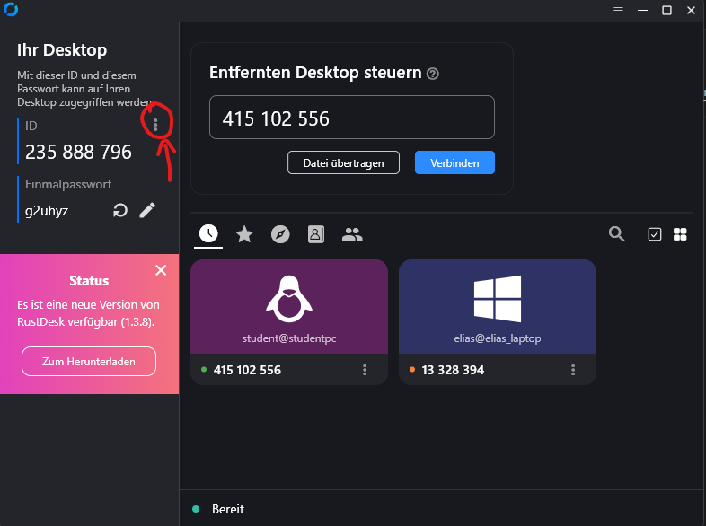
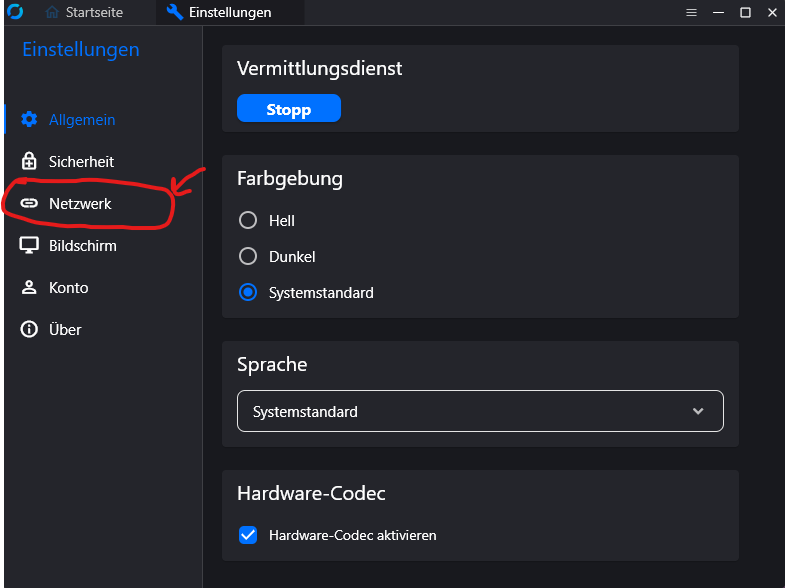
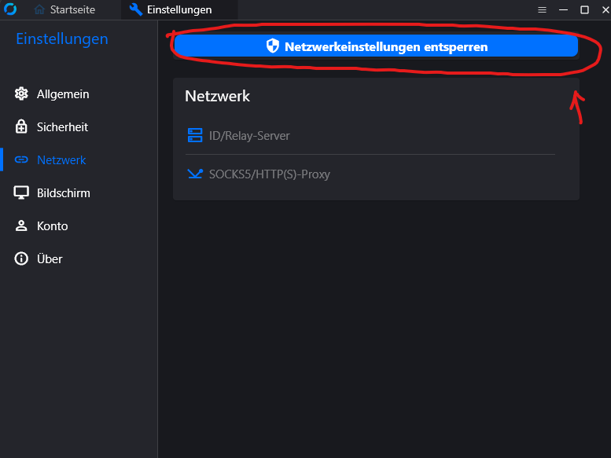
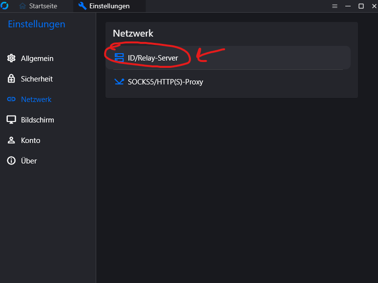
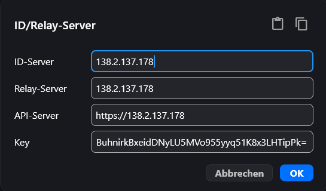
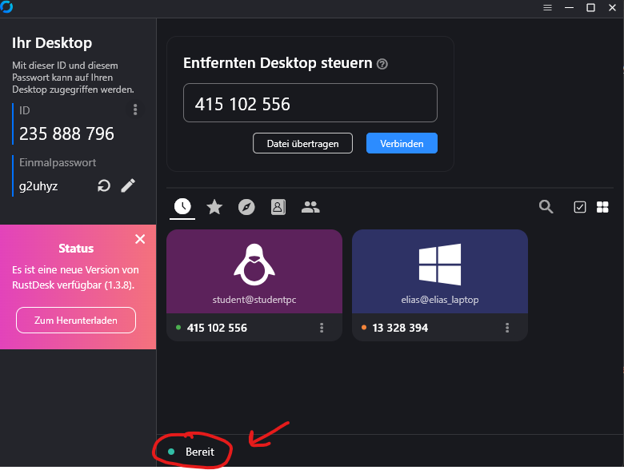
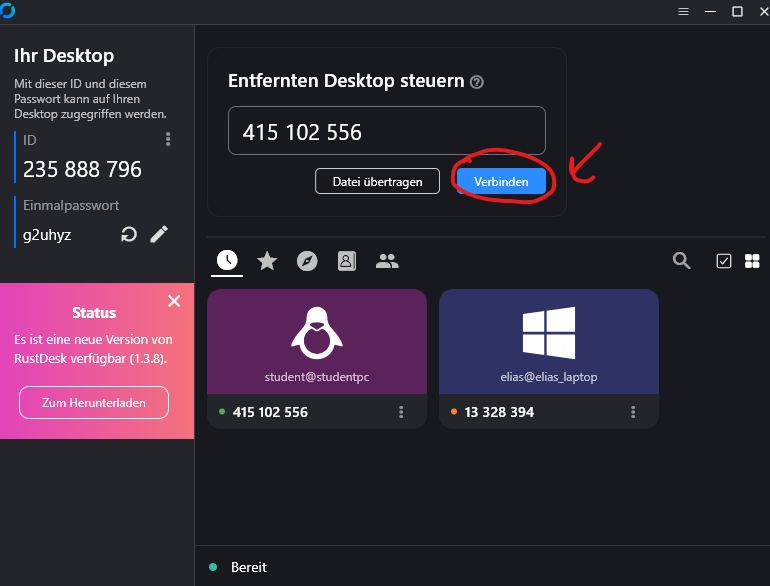
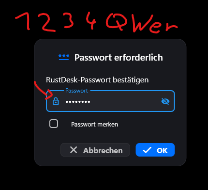
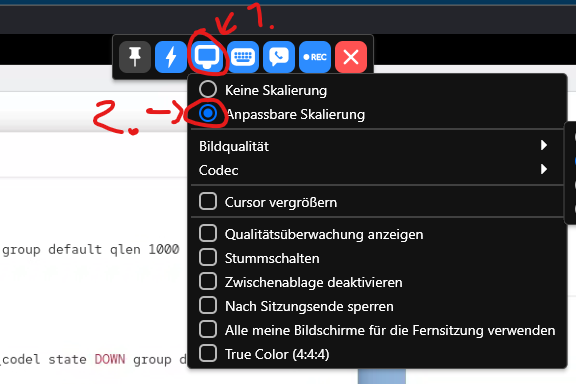
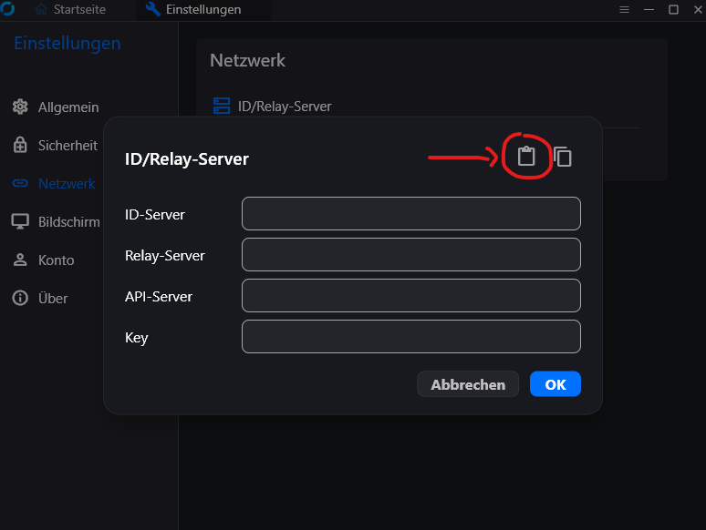

# Legend  
- [**Full Manual Setup (Option 1)**](#full-manual-setup-option-1) - Step-by-step manual setup where users configure RustDesk settings manually.  
- [**Copy/Paste Config (Option 2)**](#copy-paste-config-option-2) - Users copy and paste a pre-configured string into RustDesk, simplifying the setup.  
- [**Automatic Install via Script (Option 3)**](#automatic-install-via-script-option-3) - A script automates the installation and configuration process for RustDesk on Windows and Linux.  

# Full Manual Setup (Option 1)
1. Download from https://github.com/rustdesk/rustdesk/releases/
2. [Linux Install](https://rustdesk.com/docs/en/client/linux/), [Windows Install](https://rustdesk.com/docs/en/client/windows/)
3. Open up RustDesk
4. 
5. 
6. 
7. 
8. 
9. 
- ID-Server: `138.2.137.178`
- Relay-Server: `138.2.137.178`
- API-Server: `https://138.2.137.178`
- Key: `NkhBuhnirkBxeidDNyLU5MVo955yyq51K8x3LHTipPk=`
10. 
11. 
12. 
13. 

# Copy/Paste Config (Option 2)
1. Download from https://github.com/rustdesk/rustdesk/releases/
2. [Linux Install](https://rustdesk.com/docs/en/client/linux/), [Windows Install](https://rustdesk.com/docs/en/client/windows/)
3. Open up RustDesk
4. 
5. 
6. 
7. 
8. 
9. Copy `=0nI9sGUwlGVIx0M4hzSxUTc5lXN1kzbW1UNVxUeOREZpVGeCtmcp5Ga1JEar5kI6ISeltmIsICO3EjL3MTMuIjL4MTMv8iOzBHd0hmI6ISawFmIsICO3EjL3MTMuIjL4MTMiojI5FGblJnIsICO3EjL3MTMuIjL4MTMiojI0N3boJye`
10. 
11. 
12. 
13. 
14. 
15.  

# Automatic install via script (Option 3)
1. Download and run script from [github](https://github.com/JohnnyElaine/RustDeskSetup)
2. Windows: `WindowsAgentAIOInstall.ps1`, Linux: `linuxclientinstall.sh`